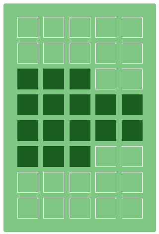
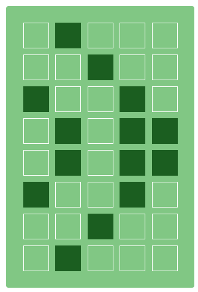
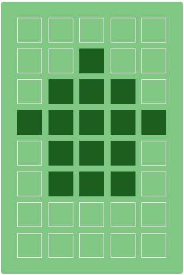
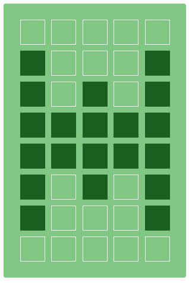

# Báo cáo hệ nhúng - Game xe vượt chướng ngại vật
- Lớp: Hệ nhúng - 143800
- Thành viên:
    - Trần Phúc Mạnh Linh - 20200352
    - Nguyễn Duy Long - 20204580
- Thiết bị: Bộ KIT 8051 PRO với vi điều khiển STC89C52

## Giới thiệu
<!-- %<Khái quát về trò chơi>% -->
**Tổng quan về Trò chơi:**

Trò chơi này chạy trên một vi điều khiển 8051 và là một trò chơi vượt chướng ngại vật với người chơi điều khiển một chiếc xe, cố gắng di chuyển qua một bản đồ thay đổi liên tục có đầy chướng ngại vật. Mục tiêu là tránh va chạm với chướng ngại vật và đi được thật xa để được điểm càng cao. Trò chơi có chướng ngại vật và nhiều loại item được biểu thị bằng các ký hiệu khác nhau, bao gồm item xóa tường gần nhất, item giảm tốc và cho item tăng tốc.

## Phân công công việc
- Trần Phúc Mạnh Linh:
    - Phụ trách phần điều khiển các thiết bị ngoại vi như LCD 16x2, Phím S1-S16, Loa.
    - Phụ trách phần điều hướng xe, xử lý va chạm và sinh chướng ngại vật trong game.
    - Thiết kế giao diện đồ họa cho game.

- Nguyễn Duy Long:
    - Phụ trách phần cơ chế tăng tốc, giảm tốc, xóa tường gần nhất.
    - Phụ trách phần sinh vật phẩm tăng tốc, giảm tốc, xóa tường gần nhất.
    - Phụ trách phần giao diện kết thúc game.

## Hướng dẫn chơi
### Đối tượng trong game
- Xe:

   
   
   Là đối tượng chính trong game, người chơi điều khiển xe để vượt qua các chướng ngại vật và thu thập các vật phẩm. Xe có thể xuống hoặc lên trên 2 làn đường.

- Xe khi tăng tốc:

   

   Xe có tốc độ nhanh hơn bình thường.

- Xe khi giảm tốc:
   
   
   
   Xe có tốc độ chậm hơn bình thường.

- Chướng ngại vật:

   

   Là vật cản, khi xe va chạm vào chướng ngại vật thì game sẽ kết thúc.

- Vật phẩm tăng tốc:

   

   Tăng tốc độ của xe lên 1.3 lần.

- Vật phẩm giảm tốc:

   

   Giảm tốc độ của xe xuống 1.3 lần.

- Vật phẩm xóa tường gần nhất:

   
   
   Xóa bỏ 1 chướng ngại vật phía trước.

### Cách chơi

1. **Điều khiển:**
   - Nhấn nút ở phía bên phải (`S5`) để di chuyển xe lên.
   - Nhấn nút ở phía bên trái (`S8`) để di chuyển xe xuống.

2. **Mục tiêu:**
   - Điều khiển xe qua bản đồ thay đổi liên tục mà không va chạm với chướng ngại vật.
   - Kiếm điểm cho mỗi hành trình thành công.

3. **Cơ chế trò chơi:**
   - Bản đồ trò chơi thay đổi liên tục liên tục từ phải qua trái, xuất hiện các chướng ngại vật hoặc item tăng tốc, giảm tốc, xóa tường gần nhất ngẫu nhiên.
   - Va chạm với chướng ngại vật dẫn đến kết thúc game.
   - Thu thập item tăng tốc, giảm tốc, xóa tường gần nhất để nhận được hiệu ứng tăng tốc độ, giảm tốc độ và xóa một chướng ngại vật phía trước.
   - Trò chơi tiếp tục cho đến khi có va chạm với chướng ngại vật, lúc đó điểm của người chơi được hiển thị.

## Các Hàm và Chức Năng của Chúng:

### a. `printInt(int num, char* dest, int destIndex)`:
- **Chức năng**: Chuyển đổi số nguyên thành chuỗi và lưu vào mảng `dest` bắt đầu từ vị trí `destIndex`.
- **Cách thức hoạt động**: Chia số nguyên để lấy từng chữ số và chuyển chúng thành ký tự. Đảo ngược chuỗi nếu cần thiết.

### b. `randomNewObstacle()`:
- **Chức năng**: Tạo ra một chướng ngại vật hoặc vật phẩm mới trên bản đồ.
- **Cách thức hoạt động**: Dựa trên trạng thái hiện tại của `map`, hàm quyết định sinh ra chướng ngại vật hoặc vật phẩm mới, có thể là trống, vị trí chéo hoặc thẳng so với chướng ngại vật trước.

### c. Các hàm `handleImpact()` và `handleImpactTypeX()`:
- **Chức năng**: Kiểm tra xem có va chạm giữa xe và chướng ngại vật hay các vật phẩm không.
- **Cách thức hoạt động**: Sử dụng toán tử `&` bit để xác định va chạm.

### d. `displayFailure()`:
- **Chức năng**: Hiển thị thông điệp thất bại và điểm số khi xe va chạm với chướng ngại vật.
- **Cách thức hoạt động**: Dừng trò chơi, cập nhật tần số âm thanh và hiển thị thông điệp trên LCD.

### e. `moveMapForward()`:
- **Chức năng**: Di chuyển bản đồ về phía trước và cập nhật các chướng ngại vật.
- **Cách thức hoạt động**: Sinh ra chướng ngại vật hoặc vật phẩm mới, cập nhật các loại chướng ngại vật và vật phẩm, và kiểm tra va chạm.

### f. `initMap()` và `renderMap()`:
- **Chức năng**: Khởi tạo và hiển thị bản đồ trò chơi.
- **Cách thức hoạt động**: `initMap` khởi tạo bản đồ ban đầu. `renderMap` hiển thị bản đồ và vị trí xe trên LCD.

### g. `initObjectsIcon()`:
- **Chức năng**: Khởi tạo các biểu tượng cho xe và các chướng ngại vật.
- **Cách thức hoạt động**: Định nghĩa các biểu tượng dưới dạng mảng byte và tải chúng vào LCD.

### h. `main()`:
- **Chức năng**: Hàm chính điều khiển luồng trò chơi.
- **Cách thức hoạt động**: Khởi tạo LCD, bản đồ, và vào vòng lặp vô hạn để xử lý nhập liệu từ người chơi và cập nhật trạng thái trò chơi.

### i. Các hàm ngắt `TIMER0_ISR()` và `TIMER1_ISR()`:
- **Chức năng**: Xử lý các sự kiện ngắt từ bộ đếm thời gian.
- **Cách thức hoạt động**: `TIMER0_ISR` cập nhật bản đồ và trạng thái trò chơi theo chu kỳ. `TIMER1_ISR` xử lý âm thanh.

## Thuật Toán Tổng Quát của Trò Chơi:

###1. **Khởi Tạo**:
   - Thiết lập các giá trị ban đầu cho bản đồ, vị trí xe.
   - Khởi tạo các biểu tượng cho xe và chướng ngại vật.
   - Khởi tạo các timer và ngắt.
   - Hiển thị bản đồ trò chơi lên LCD.
   - Dừng chương trình trong 3s (để đợi người chơi bắt đầu).
   - Bắt đầu các timer và vòng lặp `while`.

###2. **Chuẩn Bị Bản Đồ**:
   - Tạo bản đồ đầu tiên với các chướng ngại vật ngẫu nhiên.

###3. **Vòng Lặp Trò Chơi**:
   - Vòng lặp ở hàm `main()`: 
      - B1: Kiểm tra các phím người chơi bấm. Nếu người dùng bấm phím `S5` thì di chuyển xe lên, nếu bấm `S8` thì di chuyển xe xuống.
      - B2: Kiểm tra xem phía xe di chuyển lên có vật cản không? Nếu không thì mới di chuyển xe.
      - B3: Hiển thị trạng thái trò chơi trên LCD.

   - Vòng lặp hàm `TIMER0_ISR()` (Lặp lại sau mỗi 0.75s nếu xe đi với tốc độ nhanh, 1.25s nếu xe đi với tốc độ chậm, 1s nếu xe đi với tốc độ bình thường):
      - B1: Sinh phần tiếp theo của bản đồ và di chuyển bản đồ về phía trước.
      - B2: Kiểm tra xem xe có va chạm vào vật phẩm nào (tăng tốc, giảm tốc, xóa tường gần nhất) hay không? Nếu có thì thực hiện hiệu ứng của vật phẩm đó cũng như thay đổi icon xe theo trạng thái tương ứng. 
      - B3: Kiểm tra xem xe có va chạm với chướng ngại vật hay không? Nếu có thì kết thúc trò chơi. Nếu không thì sang bước 4.
      - B4: Cộng thêm 1 điểm cho người chơi.
      - B5: Hiển thị trạng thái trò chơi trên LCD.

   - Vòng lặp hàm `TIMER1_ISR()` (Lặp lại sau mỗi 10ms - 50ms): Rung loa (Đảo bit `P1_5`) để tạo âm thanh cho trò chơi.

###4. **Kết Thúc Trò Chơi**:
   - Khi người chơi va chạm chướng ngại vật, hiển thị điểm số và thông báo kết thúc trò chơi.

Tóm lại, trò chơi cung cấp một trải nghiệm đơn giản và hấp dẫn, thách thức người chơi thể hiện sự chính xác và kỹ năng phản ứng của mình. Sự kết hợp giữa các loại chướng ngại vật và sự kiện khác nhau thêm đa dạng vào lối chơi, làm cho mỗi lần chơi trở nên độc đáo. Người chơi cần có chiến thuật để đạt được điểm số cao, đồng thời liên tục thích ứng với môi trường trò chơi đang thay đổi.
